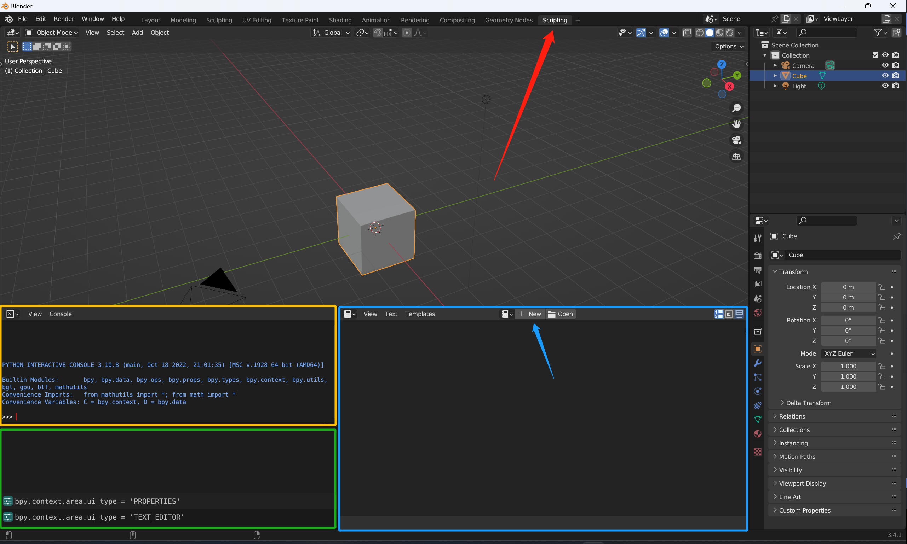
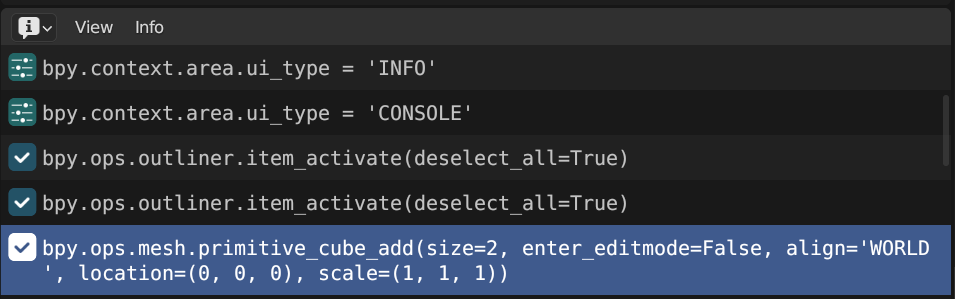
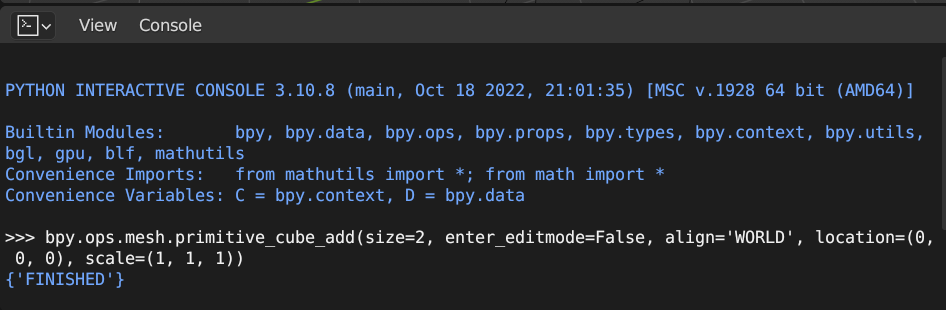
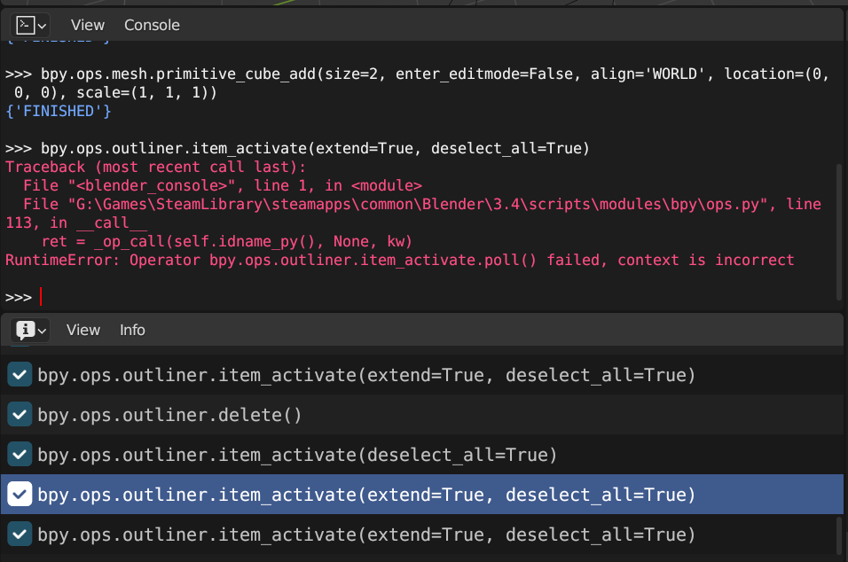
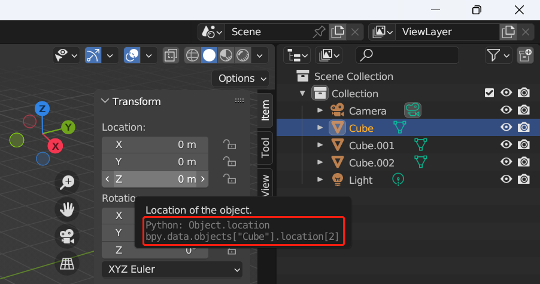

In this tutorial you can get some basic knowledge of writing scripts in Blender. **You don't need to have any pre-requisites other than some basic Python syntax.** Our goal is pretty straightforward as following:

1. Add an object in the scene
2. Modify some of the properties of the object, such as dimension and color
3. Create an animation of the object's movement by inserting keyframes
4. Render this animation

Follow these steps and you will obtain a sense of how to write your own scripts! I'll also share some basic Python script templates.

## Step 0: Prepare the environment

First, open the Blender in the default mode. Click the `Script` tab to use the script view. Now we have three useful panels:

1. `Python console`: you can run codes interactively here
2. `Text editor`: you can write lines of codes here and run them all in once
3. `Info`: some information will be logged here

Adjust these panels in a way you like.


<div class="row mt-3">
    <div class="col-sm mt-3 mt-md-0">
        
    </div>
</div>

## Step 1: Add and delete objects

Now let's begin the tutorial formally. First, we need to add an object to the scene, for instance, a block mesh. But before we indeed write the first line of code, we need to recall how we usually create an object using the GUI. Click `Add -> Mesh -> Cube` and we have a new object named `Cube.001` in the default collection. Now we can observe that in the `Info` panel the operation of adding a block is logged as a line of python code.


<div class="row mt-3">
    <div class="col-sm mt-3 mt-md-0">
        
    </div>
</div>

This is exactly what we need, so we right-click on this message and copy it, paste it into the `Python console`, tap the Enter button to run it. The console returns a "Finished" and we can see a new mesh named `Cube.002` was just created.


<div class="row mt-3">
    <div class="col-sm mt-3 mt-md-0">
        
    </div>
</div>

<blockquote>
    In the most of the time, if you don't know how to implement a specific function in Blender using Python script, just do it manually in the GUI once, and look for the corresponding code in the Info panel.
</blockquote>

Now we have to clean up the scene since we indulge ourselves in adding too many objects we don't actully need in the following steps. If we'd like to delete the `Cube` and `Cube.001`, in GUI we just need to click them with `Ctrl` hold and press `delete`. Great, we see a line of code just logged in the `Info` panel, so we just copy and run it without a hessitation. Wait wait wait, something horrible just happened. We got an error reported.


<div class="row mt-3">
    <div class="col-sm mt-3 mt-md-0">
        
    </div>
</div>

Hope you're not freaked out. If you are, just calm down and take a look at the error message, which reads "..., context is incorrect". In fact, errors due to "incorrect context" are the most common ones encountered by beginners. The concept of **context** is almost based on GUI operations, which is something like _relative path_. When writing scripts without GUI, **context** is so abstract that nobody wants to touch it. We need to seek a way using _absolute path_ only.

Now open the setting page by clicking `Edit -> Preference -> Interface`. In the `Dispaly` section you can see `Python Tooltips`. Check it, and welcome to a wholy new world! If you haven't notice anything different, hover your mouse over anywhere you want to change a value.


<div class="row mt-3">
    <div class="col-sm mt-3 mt-md-0">
        
    </div>
</div>

These tooltips are quite useful, with them we can readily access almost any property of an object (by hoverning on the property you'd like to access in GUI). In Blender all objects are stored in a `dict` called `bpy.data.objects`. We can use the name of an object as key to access it, for example, `bpy.data.objects['Cube.001']`. Recall what we will do to delete an object:

1. select the object
2. delete it

Therefore, eh writing codes we follow this slightly rigid but almost same logic:

```python
bpy.data.objects['Cube.001'].select_set(True)
bpy.ops.object.delete()
```

Run the above codes line by line in the **console**, you'll at least delete the `Cube.001` successfully. So what do I mean by "at least"? Well, if another object was also selected as well, it will also be deleted, unfortunately and innocently. Therefore, a safe practice is to deselect all objects before selecting and deleting one, which can be done by executing the following line:

```python
bpy.ops.object.select_all(action='DESELECT')
```

Now try to use what you have learnt to delete the `Cube`. If you mess something up, feel free to withdraw or rollback operations by using `Ctrl+z` or clicking `Edit -> Undo History`.

At the end of Step 1, only `Camera`, `Cube.002` and `Light` should be in our scene. But if you are really lazy to delete something, just leave it to Step 2, where we will have more tricks to get it out of the way.

Here is the first template function to delete all the objects in a given collection:

```python
def delete_all_in_collection(collection_name: str):
    bpy.ops.object.select_all(action='DESELECT')
    for item in bpy.data.collections[collection_name].objects.values():
        item.select_set(True)
    bpy.ops.object.delete()
```

## Step 2: Modify properties

If you have followed the steps above perfectly, our cube will have an ugly name, `Cube.002`, which is really annoying that everyone cannot wait to change it to a brief one. So type the following code in the console and run it:

```python
bpy.data.objects['Cube.002'].name = 'Cube'
# or equivalently
D.objects['Cube.002'].name = 'Cube'
```


bpy.data.objects['Cube.002'].name = 'Cube'
# or equivalently
D.objects['Cube.002'].name = 'Cube'


In line 1, we change the `name` property of the cube from `Cube.002` into `Cube`. Most of the properties of an object can be accessed and modified just like above. Line 3 also works because the console is so considerate that it defines a variable `D = bpy.data` in advance for convenient, as you can see in the logged information in your own console.

You may have a question now: How do I know what properties of an object I can access or modify? Well, it could a perfect chance to introduce the most powerful part of the console, that is, **interaction**. The Python console is designed to 


Enter only `D.objects['Cube']` in the console and press `Tab`, we will have a complete list of, not only properties, but also methods of the object as below:

```python
>>> D.objects['Cube'].
                      active_material
                      active_material_index
                      active_shape_key
                      active_shape_key_index
                      add_rest_position_attribute
                      animation_data
                      animation_data_clear(
                      animation_data_create(
                      animation_visualization
                      ...
```

## Step 3: Create animation

Now we have a problem that we have to face. So far we have alwasy excuting codes line by line in the console directly. But what if we would like to implement some pretty sophisticated logic with maybe 20 lines of codes, interspersed with a lot of for loops and if conditions? Blender allows us to run Python scripts writing in a `.py` file.


<!-- ## Step 4: Render! -->

