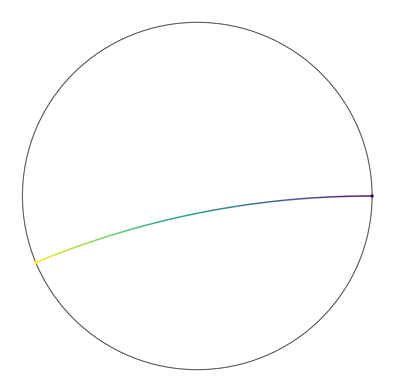
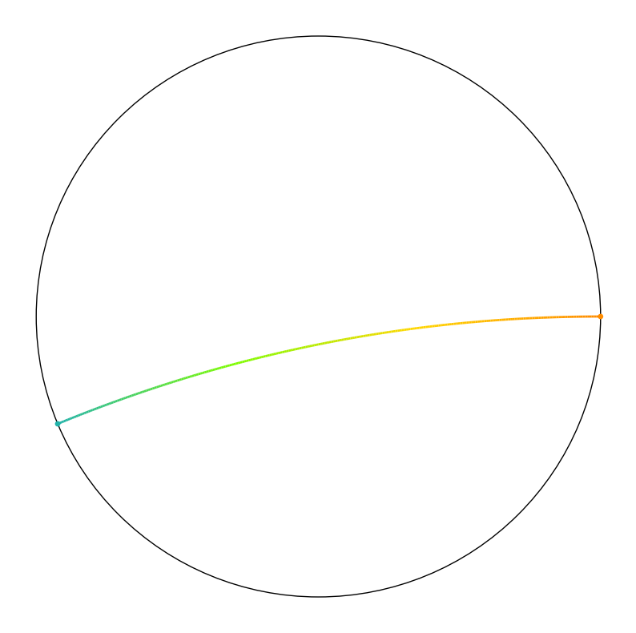
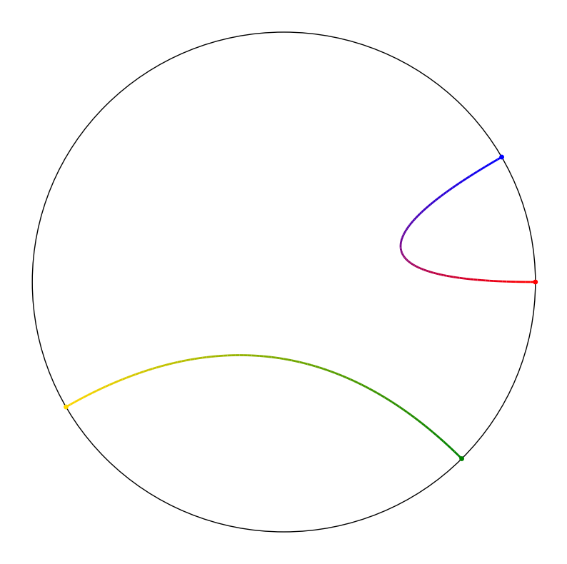

## Motivation

This project is inspired by [a chord visualization](https://zhuanlan.zhihu.com/p/570940302) of $\pi$ online, which is implemented with MATLAB:


<div class="row mt-3">
    <div class="col-sm mt-3 mt-md-0">
        
    </div>
    <div class="col-sm mt-3 mt-md-0">
        
    </div>
</div>

Really beauiful! right? Therefore, I decided to reproduce the amazing visual effect of this plot. The first thing is to determine the technical roadmap. I searched online for existing libraries and tutorials but the most related are as below:

1. A libruary called [pyCircos](https://github.com/ponnhide/pyCircos)
2. A [post](https://zhuanlan.zhihu.com/p/56744904) on zhiuhu

Their visual effect are ... not exactly what I want. Therefore! I decided to build a Python library for drawing chord plots and try to record everything in detail during this project.

Note there are two different types of chord plots. Based on their visual characteristics, I will called them **instance chord** and **proportion chord**. The first part of this post is an implementation of instance chord, just as figures above.

## Draw some curves

### Explore in the polar coordinates

It seems intuitive to draw a chord plot in the polar coordinates, so I first tried some official example codes on the matplotlib website:

```python
import numpy as np
import matplotlib.pyplot as plt

r = np.arange(0, 2, 0.01)
theta = 2 * np.pi * r

fig, ax = plt.subplots(subplot_kw={'projection': 'polar'})
ax.plot(theta, r)
ax.set_rmax(2)
ax.set_rticks([0.5, 1, 1.5, 2])  # Less radial ticks
ax.set_rlabel_position(-22.5)  # Move radial labels away from plotted line
ax.grid(True)

ax.set_title("A line plot on a polar axis", va='bottom')
plt.show()
```


<div class="row mt-3">
    <div class="col-sm mt-3 mt-md-0">
        
    </div>
</div>

### Draw bezier curves

To draw those smooth curves, I guess bezier curve is a great choice. So I tried another [example](https://matplotlib.org/stable/gallery/shapes_and_collections/quad_bezier.html) from the official doc of matplotlib to draw Bezier Curves:

```python
import matplotlib.path as mpath
import matplotlib.patches as mpatches
import matplotlib.pyplot as plt

Path = mpath.Path

fig, ax = plt.subplots()
pp1 = mpatches.PathPatch(
    Path([(0, 0), (1, 0), (1, 1), (0, 0)],
         [Path.MOVETO, Path.CURVE3, Path.CURVE3, Path.CLOSEPOLY]),
    fc="none", transform=ax.transData)

ax.add_patch(pp1)
ax.plot([0.75], [0.25], "ro")
ax.set_title('The red point should be on the path')

plt.show()
```


<div class="row mt-3">
    <div class="col-sm mt-3 mt-md-0">
        
    </div>
</div>

Then I referred to the implementation of [pyCircos](https://github.com/ponnhide/pyCircos):

```python
def chord_plot(self, start_list, end_list, facecolor=None, edgecolor=None, linewidth=0.0):
    """
    Visualize interrelationships between data.
    ...
    """
    garc_id1 = start_list[0]
    garc_id2 = end_list[0]
    center = 0 

    start1 = self._garc_dict[garc_id1].coordinates[0] 
    end1   = self._garc_dict[garc_id1].coordinates[-1] 
    size1  = self._garc_dict[garc_id1].size - 1
    sstart = start1 + ((end1-start1) * start_list[1]/size1) 
    send   = start1 + ((end1-start1) * start_list[2]/size1)
    stop   = start_list[3] 
    
    start2 = self._garc_dict[garc_id2].coordinates[0] 
    end2   = self._garc_dict[garc_id2].coordinates[-1] 
    size2  = self._garc_dict[garc_id2].size - 1
    ostart = start2 + ((end2-start2) * end_list[1]/size2) 
    oend   = start2 + ((end2-start2) * end_list[2]/size2)
    etop   = end_list[3] 

    if facecolor is None:
        facecolor = Gcircle.colors[self.color_cycle % len(Gcircle.colors)] + "80" 
        self.color_cycle += 1
    
    z1 = stop - stop * math.cos(abs((send-sstart) * 0.5)) 
    z2 = etop - etop * math.cos(abs((oend-ostart) * 0.5)) 
    if sstart == ostart: 
        pass 
    else:
        Path      = mpath.Path
        path_data = [(Path.MOVETO,  (sstart, stop)),
                        (Path.CURVE3,  (sstart, center)),     
                        (Path.CURVE3,  (oend,   etop)),
                        (Path.CURVE3,  ((ostart+oend)*0.5, etop+z2)),
                        (Path.CURVE3,  (ostart, etop)),
                        (Path.CURVE3,  (ostart, center)),
                        (Path.CURVE3,  (send,   stop)),
                        (Path.CURVE3,  ((sstart+send)*0.5, stop+z1)),
                        (Path.CURVE3,  (sstart, stop)),
                    ]
        codes, verts = list(zip(*path_data)) 
        path  = mpath.Path(verts, codes)
        patch = mpatches.PathPatch(path, facecolor=facecolor, linewidth=linewidth, edgecolor=edgecolor, zorder=0)
        self.ax.add_patch(patch)
```

I notice that the `path_data` includes some points using the `center` variable defined as `0`, I guess I can directly use the origin as the control point. I can finally draw my first Bezier Curve in a polar axis using the code below:

```python
import numpy as np
import matplotlib.pyplot as plt
import matplotlib.path    as mpath
import matplotlib.patches as mpatches

r = 1
degrees = np.arange(0, 2 * np.pi, np.pi / 8)  # (0, 22.5, 45, 67.5, ...)

fig, ax = plt.subplots(subplot_kw={'projection': 'polar'})
Path = mpath.Path
path_data = [
    (Path.MOVETO, (degrees[0], r)),
    (Path.CURVE3, (degrees[1], 0)),
    (Path.CURVE3, (degrees[2], r)),
]
codes, verts = zip(*path_data)
path = mpath.Path(verts, codes)
patch = mpatches.PathPatch(path, facecolor='none', linewidth=1, edgecolor='r', alpha=1)
ax.add_patch(patch)

ax.set_rlabel_position(-22.5)  # Move radial labels away from plotted line

plt.show()
```


<div class="row mt-3">
    <div class="col-sm mt-3 mt-md-0">
        
    </div>
</div>

We already has a nice visualization here. Now it's time to add some styles and elements to the curve. Following XHS, we at least need to:

1. add two small nodes to the ends of the curve
2. apply a gradient color to the curve

To add end nodes, we only need to add two lines of codes:

```python
for theta in degrees[:3:2]:
    ax.scatter(theta, r, c='r', s=10)
```

## Use color gradient

To apply a gradient color, there are a lot of works to do. Since we need to use `matplotlib.collections.LineCollection` to apply different colors to different segment of the curve, all the segments are requiered with explicitly performing  bezier interpolation in Cartesian coordinates. Thus, I first repeat the above steps using Cartesian coordinates.

```python
r = 1
degrees = np.arange(0, 2 * np.pi, np.pi / 8)  # (0, 22.5, 45, 67.5, ...)

fig, ax = plt.subplots(figsize=(10, 10))

# convert from polar coordinates to cartesian coordinates
X = r * np.cos(degrees[[0, 9]])
Y = r * np.sin(degrees[[0, 9]])

# compute the quadratic Bezier curve
t = np.linspace(0, 1, 100)
x = (1-t)**2 * X[0] + t**2 * X[1]
y = (1-t)**2 * Y[0] + t**2 * Y[1]

# split the curve into segments
route = np.stack([x, y], axis=1)  # (T, 2)
idxs = np.array(range(route.shape[0]))  # (0, 1, 2, ..., N-1)
norm = plt.Normalize(idxs[0], idxs[-1])
segments = np.stack([route[:-1], route[1:]], axis=1)

cmap = mpl.colormaps['viridis']
lc = LineCollection(segments, cmap=cmap, norm=norm)
lc.set_array(idxs)
lc.set_linewidth(2)
line = ax.add_collection(lc)

# draw the outer circle
circle = mpatches.Circle((0, 0), r, color='black', fill=False)
ax.add_artist(circle)

# draw two ends
cmap_ends = cmap([0., 1.])
ax.scatter(X, Y, c=cmap_ends, s=15)

ax.set_axis_off()
ax.set_xlim(-1, 1)
ax.set_ylim(-1, 1)

plt.show()
```


<div class="row mt-3">
    <div class="col-sm mt-3 mt-md-0">
        
    </div>
</div>

Here I use the quadratic Bezier curves for computational efficiency. And since I use the origin as the control point ($x_1 = 0$), the formulation can be simplified as follows:

$$
x(t) = (1-t)^2 x_0 + 2t(1-t) x_1 + t^2 x_2 = (1-t)^2 x_0 + t^2 x_2
$$

### Customize colors

Now I'd like to apply custom color gradients to the curve. Considering that the chord diagram is composed of many curves pointing from one color to another, I first attempted to interpolate between two given colors, such as blue and red. Thanks to `matplotlib.colors.LinearSegmentedColormap`, I can directly use two colors to create a colormap. The only thing I need to do is replace the `cmap` with the following:

```python
colors = [(1, 0, 0), (0, 0, 1)]  # R -> B
cmap = LinearSegmentedColormap.from_list('RedBlue', colors, N=256)
```

which yields below:


<div class="row mt-3">
    <div class="col-sm mt-3 mt-md-0">
        
    </div>
</div>

The `colors` argument fed to `from_list` method is a list of colors, whose elements can be either tuples and strings indicating colors. An example of using strings is as follows:

```python
colors = ["darkorange", "gold", "lawngreen", "lightseagreen"]
cmap = LinearSegmentedColormap.from_list('AGreatCmap', colors, N=256)
```

which yields below:


<div class="row mt-3">
    <div class="col-sm mt-3 mt-md-0">
        
    </div>
</div>

## Functionality Encapsulation

Since I already have the basic functionality of drawing a curve with given coordinates and colors, it's a good choice to wrap them into a class. To unify the designation, I will call the start point **source** and the end point **target**.

```python
from typing import Union

import numpy as np
import matplotlib.pyplot  as plt
import matplotlib.patches as mpatches
from matplotlib.collections import LineCollection, PathCollection
from matplotlib.colors import Colormap, LinearSegmentedColormap

CmapLike = Union[LinearSegmentedColormap, Colormap]

class Chord:
    def __init__(self, r: float = 1, linewidth: float = 2, 
                 use_outer_circle: bool = True, divisions: int = 100):
        self.r = r
        self.lw = linewidth
        self.fig, self.ax = plt.subplots(figsize=(10, 10))
        if use_outer_circle:
            self.draw_circle()
        self._prepare_t(divisions)

        self.ax.set_axis_off()
        lim = np.array((-1.1, 1.1)) * r
        self.ax.set_xlim(*lim)
        self.ax.set_ylim(*lim)

    def _prepare_t(self, divisions: int):
        self.divsions = divisions
        t = np.linspace(0, 1, divisions)
        self.T2 = np.stack((1-t, t), axis=1) ** 2

    def get_cmap(self, colors: list[Union[str, tuple[float]]]):
        return LinearSegmentedColormap.from_list('my_cmap', colors, N=self.divsions)

    def add_curve(self, src_tgt: tuple[float], 
                  cmap: CmapLike):
        # polar to cartesian
        x = np.cos(src_tgt)
        y = np.sin(src_tgt)
        xy = self.r * np.stack((x, y), axis=1)

        # compute the quadratic Bezier curve
        XY = self.T2 @ xy  # (T, 2) @ (2, 2) -> (T, 2)

        # split the curve into segments
        segments = np.stack([XY[:-1], XY[1:]], axis=1)
        idxs = np.array(range(XY.shape[0]))  # (0, 1, 2, ..., T-1)
        norm = plt.Normalize(idxs[0], idxs[-1])
        
        lc = LineCollection(segments, linewidths=self.lw, cmap=cmap, norm=norm, antialiaseds=True)
        lc.set_array(idxs)
        self.ax.add_collection(lc)

        # draw two ends
        self.ax.scatter(*xy.T, s=15, c=cmap([0, 1.]))
    
    def draw_circle(self):
        # draw the outer circle
        circle = mpatches.Circle((0, 0), self.r, color='black', fill=False)
        self.ax.add_artist(circle)

    def remove_curves(self):
        for c in self.ax.collections:
            if type(c) in [LineCollection, PathCollection]:
                c.remove()

    def show(self):
        self.fig.show()
        plt.show()
    
    def get_fig(self):
        return self.fig
```

Now it's much more handy to draw a chord curves:

```python
graph = Chord()
graph.remove_curves()

cmap1 = graph.get_cmap(['red', 'blue'])
graph.add_curve(start_end=np.array((0, 30)) / 180 * np.pi, cmap=cmap1)

cmap2 = graph.get_cmap(['green', 'gold'])
graph.add_curve(start_end=np.array((-45, 210)) / 180 * np.pi, cmap=cmap2)

graph.show()
```


<div class="row mt-3">
    <div class="col-sm mt-3 mt-md-0">
        
    </div>
</div>

Note that I have made some optimizations in calculating the Bessel curves, hoping to speed up the drawing when there are much more curves in the graph.

## Position and color encoding

Now I have implemented the fundamental component function of the whole project. The next step is to assign the right position and color to the given data. I will use $\pi$ in the test time. Each curve in the figure indicates that there exist two adjacent numbers in $\pi$, where the former is the number at the starting point and the latter is the number at the end point. I get the irst 10,000 digits of $\pi$ from [here](https://www.piday.org/million/), which is more than enough for test use.

### Data format

Before using data to draw a chord plot, I need to determine how to represent and organize the data to draw in a neat manner. For convinience, I choose to store the frequncies of all combinations of two adjacent numbers with a 2-d array in `numpy`. If the categories are not numeric, they can also be indexed with 0,1,2,...,N, where N is the total numbers of categoryies.

```python
def PI2array(ndigits: int = 100):
    pi = PI[:ndigits]
    array = np.zeros((10, 10), dtype=int)
    for i, j in zip(pi[:-1], pi[1:]):
        array[int(i), int(j)] += 1

    return array
```

By default, this function returns a statistic array of the first 100 digits of $\pi$:

```python
>>> PI2array()
array([[0, 0, 1, 1, 0, 1, 2, 1, 1, 1],
       [1, 1, 0, 0, 1, 1, 2, 1, 0, 1],
       [2, 1, 0, 2, 0, 1, 2, 1, 3, 0],
       [1, 1, 2, 1, 2, 1, 0, 1, 2, 1],
       [1, 2, 1, 1, 1, 1, 1, 0, 1, 1],
       [1, 1, 0, 2, 0, 0, 0, 0, 2, 2],
       [0, 0, 4, 0, 2, 1, 0, 1, 0, 1],
       [1, 1, 0, 0, 1, 1, 0, 0, 1, 2],
       [1, 1, 2, 1, 2, 0, 2, 0, 1, 2],
       [0, 0, 2, 3, 1, 1, 0, 3, 1, 2]])
```

With this data, I can determine how much space to allocate for each category. Two straightforward strategies can be used:

- Evenly distributed between categories
- With higher frequencies, comes more space

Intuitively, the total frequency of a category is the sum of the frequency of being source and being target. Although in this $\pi$ case, these two frequencies are almost the same(since the target will become source in the next pair of adjacent digits), to unify the interface I still compute the sum of them:

```python
def compute_freq(data: np.ndarray) -> np.ndarray:
    assert data.ndim == 2, "data.ndim must be 2 to draw a chord plot!"
    return data.sum(axis=0) + data.sum(axis=1)
```

With the frequencies, I can arrange a number of nodes for each category such that e curve can randomly choose a node from the source category and a node from the target category. I divide 2 from frequency to get the number of nodes. And I'd like to add a gap between different categories. I choose a gap size of 1.5 times the node interval. All these settings can be wrapped into a function to compute the locations of nodes with given data:

```python
def compute_locs(data: ndarray, 
                 node_ratio: float = 2,
                 gap_ratio: float = 1.5) -> list[ndarray]:
    freq = compute_freq(data)
    freq = (freq / node_ratio).astype(int)

    freq_ = (freq - 1) + gap_ratio
    prop = freq_ / freq_.sum()
    gap = gap_ratio / freq_.sum()
    
    c = data.shape[0]
    tri = np.triu(np.ones((c, c+1)), k=1)
    cprop = prop @ tri

    prop_range = np.vstack((cprop[:-1], cprop[1:] - gap)).T
    locs = [2*np.pi*np.linspace(*prop_range[i], freq[i]) for i in range(len(freq))]

    return locs
```

One can verify the above settings readily:

```python
>>> locs = compute_locs(data)
>>> locs[0][1] - locs[0][0], locs[1][1] - locs[1][0]
(0.06100179909883093, 0.061001799098830856)
>>> (locs[1][0] - locs[0][-1]) / (locs[1][1] - locs[1][0])
1.5000000000000027
```

## To be continued
