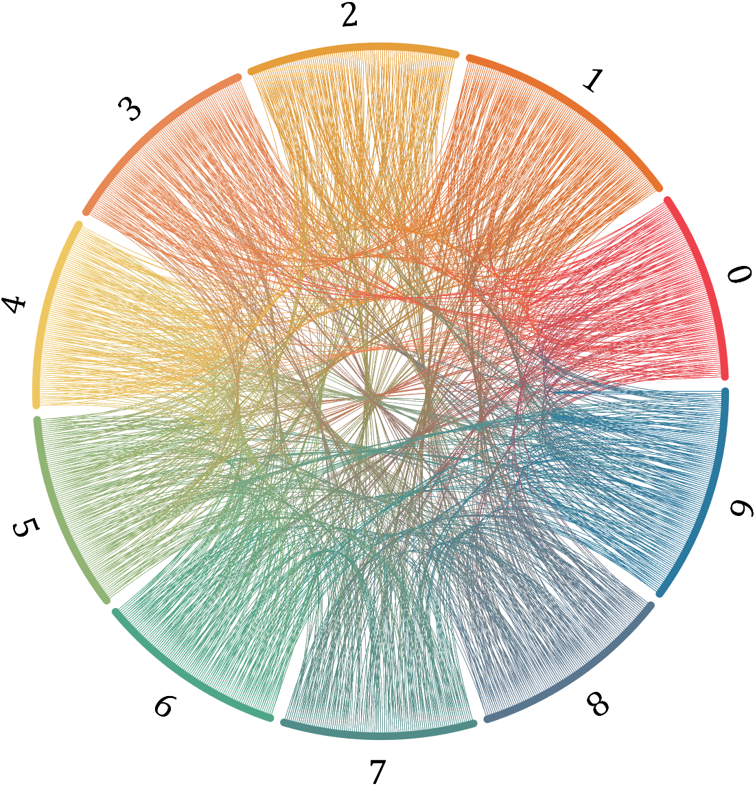
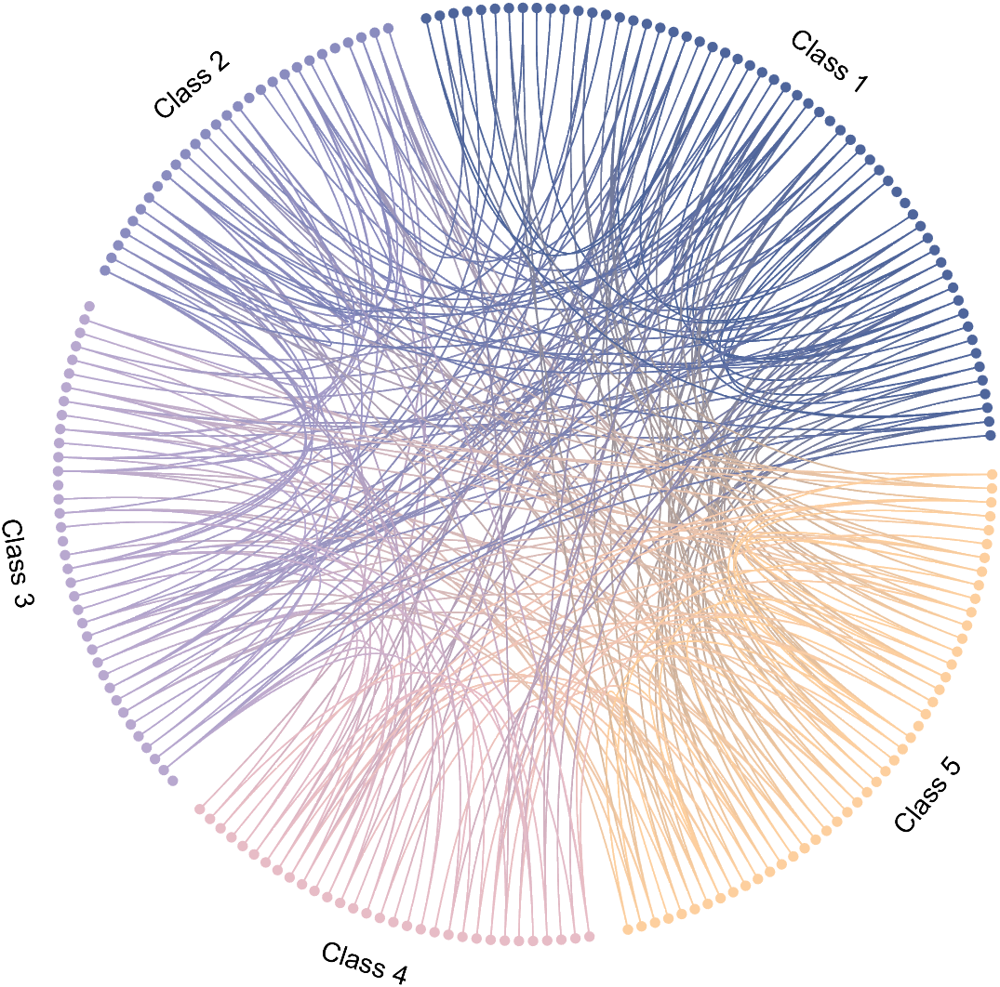
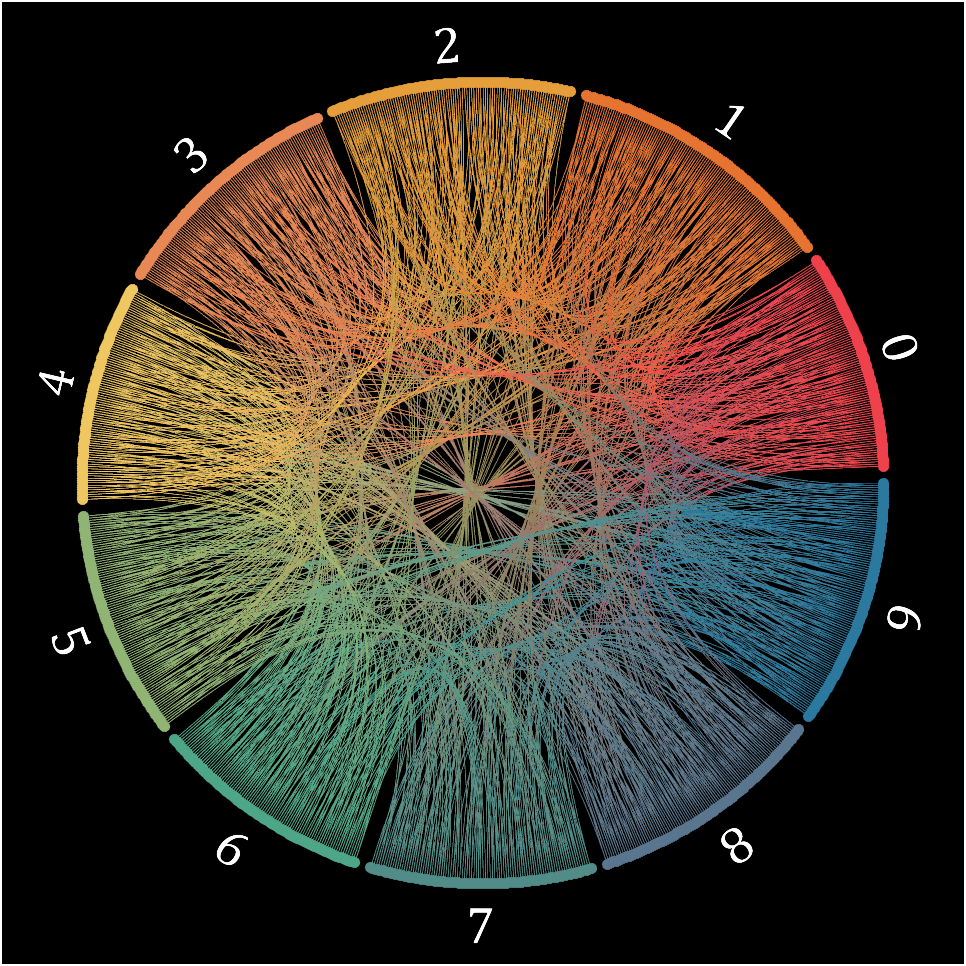
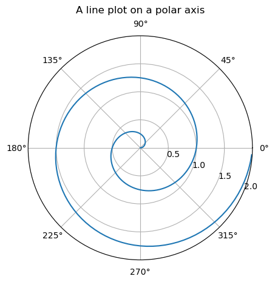
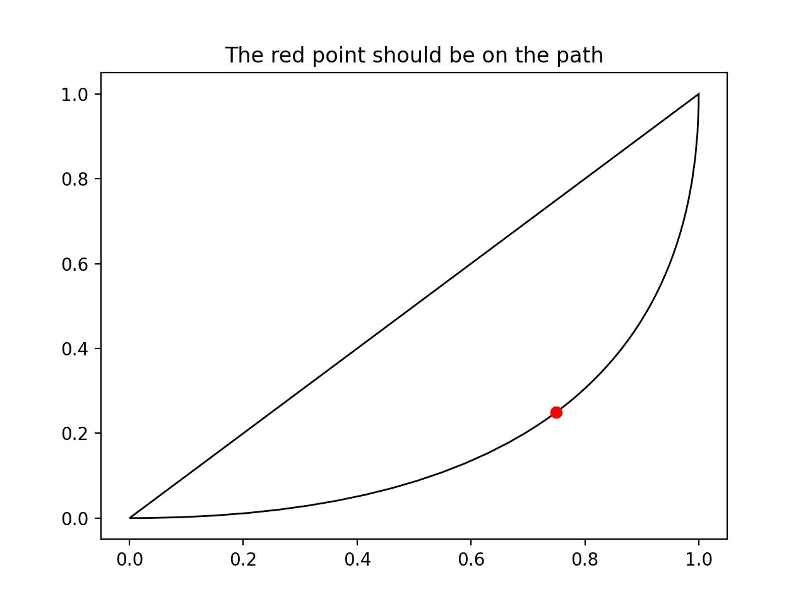
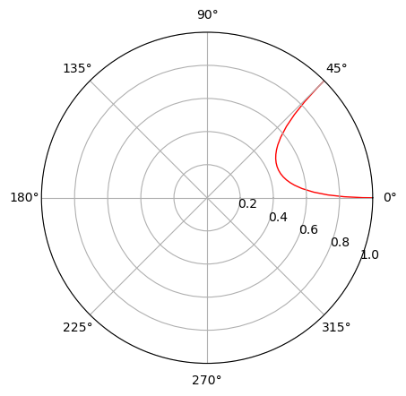

## Motivation

This project is inspired by [a chord visualization](https://zhuanlan.zhihu.com/p/570940302) of $\pi$ online, which is implemented with MATLAB:




<div class="row mt-3">
    <div class="col-sm mt-3 mt-md-0">
        
    </div>
    <div class="col-sm mt-3 mt-md-0">
        
    </div>
</div>

Really beauiful! right? Therefore, I decided to reproduce the amazing visual effect of this plot. The first thing is to determine the technical roadmap. I searched online for existing libraries and tutorials but the most related are as below:

1. A libruary called [pyCircos](https://github.com/ponnhide/pyCircos)

<!-- 
<div class="row mt-3">
    <div class="col-sm mt-3 mt-md-0">
        
    </div>
</div> -->

2. A [post](https://zhuanlan.zhihu.com/p/56744904) on zhiuhu

Their visual effect are ... not so saisfactory. Therefore! I decided to build a Python library for drawing chord plots and try to record everything in detail during this project.

## Have some try

```python
import numpy as np
import matplotlib.pyplot as plt

r = np.arange(0, 2, 0.01)
theta = 2 * np.pi * r

fig, ax = plt.subplots(subplot_kw={'projection': 'polar'})
ax.plot(theta, r)
ax.set_rmax(2)
ax.set_rticks([0.5, 1, 1.5, 2])  # Less radial ticks
ax.set_rlabel_position(-22.5)  # Move radial labels away from plotted line
ax.grid(True)

ax.set_title("A line plot on a polar axis", va='bottom')
plt.show()
```


<div class="row mt-3">
    <div class="col-sm mt-3 mt-md-0">
        
    </div>
</div>

And I tried an [example](https://matplotlib.org/stable/gallery/shapes_and_collections/quad_bezier.html) from the official doc of matplotlib to draw Bezier Curves:

```python
import matplotlib.path as mpath
import matplotlib.patches as mpatches
import matplotlib.pyplot as plt

Path = mpath.Path

fig, ax = plt.subplots()
pp1 = mpatches.PathPatch(
    Path([(0, 0), (1, 0), (1, 1), (0, 0)],
         [Path.MOVETO, Path.CURVE3, Path.CURVE3, Path.CLOSEPOLY]),
    fc="none", transform=ax.transData)

ax.add_patch(pp1)
ax.plot([0.75], [0.25], "ro")
ax.set_title('The red point should be on the path')

plt.show()
```


<div class="row mt-3">
    <div class="col-sm mt-3 mt-md-0">
        
    </div>
</div>

Then I referred to the implementation of [pyCircos](https://github.com/ponnhide/pyCircos):

```python
def chord_plot(self, start_list, end_list, facecolor=None, edgecolor=None, linewidth=0.0):
    """
    Visualize interrelationships between data.
    ...
    """
    garc_id1 = start_list[0]
    garc_id2 = end_list[0]
    center = 0 

    start1 = self._garc_dict[garc_id1].coordinates[0] 
    end1   = self._garc_dict[garc_id1].coordinates[-1] 
    size1  = self._garc_dict[garc_id1].size - 1
    sstart = start1 + ((end1-start1) * start_list[1]/size1) 
    send   = start1 + ((end1-start1) * start_list[2]/size1)
    stop   = start_list[3] 
    
    start2 = self._garc_dict[garc_id2].coordinates[0] 
    end2   = self._garc_dict[garc_id2].coordinates[-1] 
    size2  = self._garc_dict[garc_id2].size - 1
    ostart = start2 + ((end2-start2) * end_list[1]/size2) 
    oend   = start2 + ((end2-start2) * end_list[2]/size2)
    etop   = end_list[3] 

    if facecolor is None:
        facecolor = Gcircle.colors[self.color_cycle % len(Gcircle.colors)] + "80" 
        self.color_cycle += 1
    
    z1 = stop - stop * math.cos(abs((send-sstart) * 0.5)) 
    z2 = etop - etop * math.cos(abs((oend-ostart) * 0.5)) 
    if sstart == ostart: 
        pass 
    else:
        Path      = mpath.Path
        path_data = [(Path.MOVETO,  (sstart, stop)),
                        (Path.CURVE3,  (sstart, center)),     
                        (Path.CURVE3,  (oend,   etop)),
                        (Path.CURVE3,  ((ostart+oend)*0.5, etop+z2)),
                        (Path.CURVE3,  (ostart, etop)),
                        (Path.CURVE3,  (ostart, center)),
                        (Path.CURVE3,  (send,   stop)),
                        (Path.CURVE3,  ((sstart+send)*0.5, stop+z1)),
                        (Path.CURVE3,  (sstart, stop)),
                    ]
        codes, verts = list(zip(*path_data)) 
        path  = mpath.Path(verts, codes)
        patch = mpatches.PathPatch(path, facecolor=facecolor, linewidth=linewidth, edgecolor=edgecolor, zorder=0)
        self.ax.add_patch(patch)
```

I can finally draw my first Bezier Curve in a polar axis using the code below:

```python
import numpy as np
import matplotlib.pyplot as plt
import matplotlib.path    as mpath
import matplotlib.patches as mpatches

r = 1
degrees = np.arange(0, 2 * np.pi, np.pi / 8)  # (0, 22.5, 45, 67.5, ...)

fig, ax = plt.subplots(subplot_kw={'projection': 'polar'})
Path = mpath.Path
path_data = [
    (Path.MOVETO, (degrees[0], r)),
    (Path.CURVE3, (degrees[1], 0)),
    (Path.CURVE3, (degrees[2], r)),
]
codes, verts = zip(*path_data)
path = mpath.Path(verts, codes)
patch = mpatches.PathPatch(path, facecolor='none', linewidth=1, edgecolor='r', alpha=1)
ax.add_patch(patch)

ax.set_rlabel_position(-22.5)  # Move radial labels away from plotted line

plt.show()
```


<div class="row mt-3">
    <div class="col-sm mt-3 mt-md-0">
        
    </div>
</div>

Now it's time to add some styles and elements to the curve. Following XHS, we at least need to:

1. add two small circles to the ends of the curve
2. apply a gradient color to the curve

To add end circles, we only need to add two lines of codes:

```python
for theta in degrees[:3:2]:
    ax.scatter(theta, r, c='r', s=10)
```

To apply a gradient color, there are a lot of works to do. Since we need to use `from matplotlib.collections.LineCollection` to apply different colors to different segment of the curve, all the segments are requiered with explicitly performing  bezier interpolation in Cartesian coordinates. Thus, we first repeat the above steps using Cartesian coordinates.
